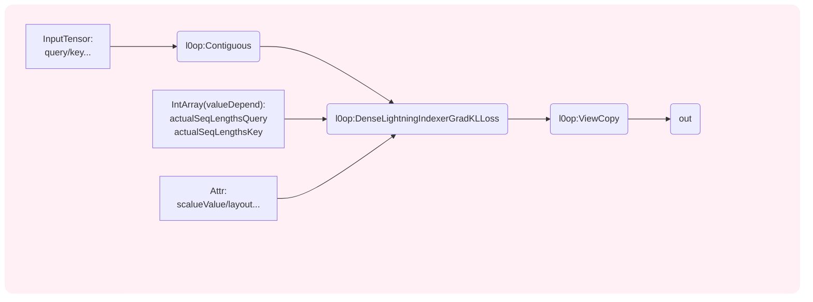

# aclnnDenseLightningIndexerGradKLLoss

## 产品支持情况

| 产品                               | 是否支持 |
| ---------------------------------- | :------: |
| <term>Atlas A3 训练系列产品</term> |    √     |
| <term>Atlas A2 训练系列产品</term> |    √     |

## 功能说明

- 算子功能：DenseLightningIndexerGradKlLoss算子是LightningIndexer的反向算子，再额外融合了Loss计算功能。LightningIndexer算子将QueryToken和KeyToken之间的最高内在联系的TopK个筛选出来，从而减少长序列场景下Attention的计算量，加速长序列的网络的推理和训练的性能。稠密场景下的LightningIndexerGrad的输入query、key、query_index、key_index不用做稀疏化处理。


- 计算公式：

  1. Top-k value的计算公式：

  $$
  I_{t,:}=W_{t,:}@ReLU(\tilde{q}_{t,:}@\tilde{K}_{:t,:}^\top)
  $$

    - $W_{t,:}$是第$t$个token对应的$weights$；
    - $\tilde{q}_{t,:}$是$\tilde{q}$矩阵第$t$个token对应的$G$个query头合轴后的结果；
    - $\tilde{K}_{:t,:}$为$t$行$\tilde{K}$矩阵。

  2. 正向的Softmax对应公式：

  $$
  p_{t,:} = \text{Softmax}(q_{t,:} @ K_{:t,:}^\top/\sqrt{d})
  $$

    - $p_{t,:}$是第$t$个token对应的Softmax结果；
    - $q_{t,:}$是$q$矩阵第$t$个token对应的$G$个query头合轴后的结果；
    - ${K}_{:t,:}$为$t$行$K$矩阵。

  3. npu_lightning_indexer会单独训练，对应的loss function为：

  $$
  Loss{=}\sum_tD_{KL}(p_{t,:}||Softmax(I_{t,:}))
  $$

  其中，$p_{t,:}$是target distribution，通过对main attention score 进行所有的head的求和，然后把求和结果沿着上下文方向进行L1正则化得到。$D_{KL}$为KL散度，其表达式为：

  $$
  D_{KL}(a||b){=}\sum_ia_i\mathrm{log}{\left(\frac{a_i}{b_i}\right)}
  $$

  4. 通过求导可得Loss的梯度表达式：

  $$
  dI\mathop{{}}\nolimits_{{t,:}}=Softmax \left( I\mathop{{}}\nolimits_{{t,:}} \left) -p\mathop{{}}\nolimits_{{t,:}}\right. \right.
  $$

  利用链式法则可以进行weights，query和key矩阵的梯度计算：
  $$
  dW\mathop{{}}\nolimits_{{t,:}}=dI\mathop{{}}\nolimits_{{t,:}}\text{@} \left( ReLU \left( S\mathop{{}}\nolimits_{{t,:}} \left) \left) \mathop{{}}\nolimits^{\top}\right. \right. \right. \right.
  $$

  $$
  d\mathop{{\tilde{q}}}\nolimits_{{t,:}}=dS\mathop{{}}\nolimits_{{t,:}}@\tilde{K}\mathop{{}}\nolimits_{{:t,:}}
  $$

  $$
  d\tilde{K}\mathop{{}}\nolimits_{{:t,:}}=\left(dS\mathop{{}}\nolimits_{{t,:}} \left) \mathop{{}}\nolimits^{\top}@\tilde{q}\mathop{{}}\nolimits_{{:t, :}}\right. \right.
  $$

  其中，$S$为$\tilde{q}$和$K$矩阵乘的结果。


<!-- - **说明**：

   <blockquote>query、key、value数据排布格式支持从多种维度解读，其中B（Batch）表示输入样本批量大小、S（Seq-Length）表示输入样本序列长度、H（Head-Size）表示隐藏层的大小、N（Head-Num）表示多头数、D（Head-Dim）表示隐藏层最小的单元尺寸，且满足D=H/N、T表示所有Batch输入样本序列长度的累加和。
   </blockquote> -->


## 函数原型

算子执行接口为两段式接口，必须先调用“aclnnDenseLightningIndexerGradKLLossGetWorkspaceSize”接口获取入参并根据计算流程计算所需workspace大小，再调用“aclnnDenseLightningIndexerGradKLLoss”接口执行计算。

```c++
aclnnStatus aclnnDenseLightningIndexerGradKLLossGetWorkspaceSize(
    const aclTensor     *query,
    const aclTensor     *key,
    const aclTensor     *queryIndex,
    const aclTensor     *keyIndex,
    const aclTensor     *weights,
    const aclTensor     *softmaxMax,
    const aclTensor     *softmaxSum,
    const aclTensor     *softmaxMaxIndex,
    const aclTensor     *softmaxSumIndex,
    const aclTensor     *queryRope,
    const aclTensor     *keyRope,
    const aclIntArray   *actualSeqLengthsQuery,
    const aclIntArray   *actualSeqLengthsKey,
    double               scaleValue,
    char                *layout,
    int64_t              sparseMode,
    int64_t              pre_tokens,
    int64_t              next_tokens,
    const aclTensor     *dQueryIndex,
    const aclTensor     *dKeyKndex,
    const aclTensor     *dWeights
    const aclTensor     *loss,
    uint64_t            *workspaceSize,
    aclOpExecutor       *executor)
```

```c++
aclnnStatus aclnnDenseLightningIndexerGradKLLoss(
    void             *workspace, 
    uint64_t          workspaceSize, 
    aclOpExecutor    *executor, 
    const aclrtStream stream)
```

## aclnnDenseLightningIndexerGradKLLoss

- **参数说明:**

  <table style="undefined;table-layout: fixed; width: 1550px">
      <colgroup>
          <col style="width: 220px">
          <col style="width: 120px">
          <col style="width: 300px">  
          <col style="width: 400px">  
          <col style="width: 212px">  
          <col style="width: 100px">
          <col style="width: 190px">
          <col style="width: 145px">
          </colgroup>
      <thead>
      <tr>
          <th>参数名</th>
          <th>输入/输出</th>
          <th>描述</th>
          <th>使用说明</th>
          <th>数据类型</th>
          <th>数据格式</th>
          <th>layout</th>
          <th>非连续Tensor</th>
      </tr></thead>
      <tbody>
      <tr>
          <td>query</td>
          <td>输入</td>
          <td>attention结构的输入Q</td>
          <td>
          <ul>
              <li>B: 支持泛化。</li>
              <li>S1: 支持泛化。</li>
              <li>N1: 支持128、64、32。</li>
              <li>D: 128。</li>
              <li>T1: 多个Batch的S1累加。</li>
          </ul>
          </td>
          <td>FLOAT16、BFLOAT16 </td>
          <td>ND</td>
          <td>(B,S1,N1,D);(T1,N1,D)</td>
          <td>×</td>
      </tr>
      <tr>
          <td>key</td>
          <td>输入</td>
          <td>attention结构的输入K</td>
          <td>
          <ul>
              <li>B: 支持泛化且与query的B保持一致。</li>
              <li>S2: 支持泛化。</li>
              <li>N2: 等于N1。</li>
              <li>D: 128。</li>
              <li>T2: 多个Batch的S2累加。</li>                
          </ul>
          </td>
          <td>FLOAT16、BFLOAT16 </td>
          <td>ND</td>
          <td>(B,S2,N2,D);(T2,N2,D)</td>
          <td>×</td>
      </tr>
      <tr>
          <td>queryIndex</td>
          <td>输入</td>
          <td>lightingIndexer结构的输入queryIndex。</td>
          <td>
          <ul>
              <li>B: 支持泛化且与query的B保持一致。</li>
              <li>S1: 支持泛化。</li>
              <li>Nidx1: 64、32、16、8。</li>
              <li>D: 128。</li>
              <li>T1: 多个Batch的S1累加。</li>
          </ul>
          </td>
          <td>FLOAT16、BFLOAT16</td>
          <td>ND</td>
          <td>(B,S1,Nidx1,D);(T1,Nidx1,D)</td>
          <td>×</td>
      </tr>
      <tr>
          <td>keyIndex</td>
          <td>输入</td>
          <td>lightingIndexer结构的输入keyIndex。</td>
          <td>
          <ul>
              <li>B: 支持泛化且与query的B保持一致。</li> 
              <li>S2: 支持泛化。</li>
              <li>Nidx2: 1。</li>
              <li>D: 128。</li>
              <li>T2: 多个Batch的S2累加。</li>
          </ul>
          </td>
          <td>FLOAT16、BFLOAT16</td>
          <td>ND</td>
          <td>(B,S2,Nidx2,D);(T2,Nidx2,D)</td>
          <td>×</td>
      </tr>
      <tr>
          <td>weights</td>
          <td>输入</td>
          <td>权重</td>
          <td>
          <ul>
              <li>B: 支持泛化且与query的B保持一致。</li>
              <li>S1: 支持泛化且与query的S1保持一致。</li>
              <li>Nidx1: 64、32、16、8。</li>
              <li>T1: 多个Batch的S1累加。</li>
          </ul>
          </td>
          <td>FLOAT16、BFLOAT16</td>
          <td>ND</td>
          <td>(B,S1,Nidx1);(T1,Nidx1)</td>
          <td>×</td>
      </tr>
      <tr>
          <td>softmaxMax</td>与query的B保持一致
          <td>输入</td>
          <td>Device侧的aclTensor，注意力正向计算的中间输出</td>
          <td>
          <ul>
              <li>B: 支持泛化与query的B保持一致。</li>
              <li>N2: 等于N1。</li>
              <li>S1: 支持泛化且与query的S1保持一致。</li>
              <li>G: N1/N2。</li>
              <li>T1: 多个Batch的S1累加。</li>
          </ul>
          <td>FLOAT32</td>
          <td>ND</td>
          <td>(B,N2,S1,G);(N2,T1,G)</td>
          <td>×</td>
      </tr>
      <tr>
          <td>softmaxSum</td>
          <td>输入</td>
          <td>Device侧的aclTensor，注意力正向计算的中间输出</td>
          <td>
          <ul>
              <li>B: 支持泛化与query的B保持一致。</li>
              <li>N2: 等于N1。</li>
              <li>S1: 支持泛化且与query的S1保持一致。</li>
              <li>G: N1/N2。</li>
              <li>T1: 多个Batch的S1累加。</li>
          </ul>
          <td>FLOAT32</td>
          <td>ND</td>
          <td>(B,N2,S1,G);(N2,T1,G)</td>
          <td>×</td>
      </tr>
      <tr>
          <td>softmaxMaxIndex</td>与query的B保持一致
          <td>输入</td>
          <td>Device侧的aclTensor，注意力正向计算的中间输出</td>
          <td>
          <ul>
              <li>B: 支持泛化与query的B保持一致。</li>
              <li>Nidx2: 1。</li>
              <li>S1: 支持泛化且与query的S1保持一致。</li>
              <li>T1: 多个Batch的S1累加。</li>
          </ul>
          <td>FLOAT32</td>
          <td>ND</td>
          <td>(B,Nidx2,S1);(Nidx2,T1)</td>
          <td>×</td>
      </tr>
      <tr>
          <td>softmaxSumIndex</td>
          <td>输入</td>
          <td>Device侧的aclTensor，注意力正向计算的中间输出</td>
          <td>
          <ul>
              <li>B: 支持泛化与query的B保持一致。</li>
              <li>Nidx2: 1。</li>
              <li>S1: 支持泛化且与query的S1保持一致。</li>
              <li>T1: 多个Batch的S1累加。</li>
          </ul>
          <td>FLOAT32</td>
          <td>ND</td>
          <td>(B,Nidx2,S1);(Nidx2,T1)</td>
          <td>√</td>
      </tr>
      <tr>
          <td>queryRope</td>
          <td>输入</td>
          <td>MLA rope部分：Query位置编码的输出。</td>
          <td>
          <ul>
              <li>与query的layout维度保持一致。</li>
              <li>B: 支持泛化与query的B保持一致。</li>
              <li>S1: 支持泛化且与query的S1保持一致。</li>
              <li>N1: 128、64、32。</li>
              <li>Dr: 64。</li>
              <li>T1: 多个Batch的S1累加。</li>
          </ul>
          </td>
          <td>FLOAT16、BFLOAT16</td>
          <td>ND</td>
          <td>(B,S1,N1,Dr);(T1,N1,Dr)</td>
          <td>√</td>
      </tr>
      <tr>
          <td>keyRope</td>
          <td>输入</td>
          <td>MLA rope部分：Key位置编码的输出</<td>
          <td>
          <ul>
              <li>与key的layout维度保持一致。</li>
              <li>B: 支持泛化与query的B保持一致。</li>
              <li>S2: 支持泛化且与key的S1保持一致。</li>
              <li>N2: 等于N1。</li>
              <li>Dr: 64。</li>
              <li>T2: 多个Batch的S2累加。</li>
          </ul>
          </td>
          <td>FLOAT16、BFLOAT16</td>
          <td>ND</td>
          <td>(B,S2,N2,Dr);(T2,N2,Dr)</td>
          <td>√</td>
      </tr>    
      <tr>
          <td>actualSeqLengthsQuery</td>
          <td>输入</td>
          <td>每个Batch中，Query的有效token数</td>
          <td>
          <ul>
              <li>值依赖。</li>
              <li>长度与B保持一致。</li>
              <li>累加和与T1保持一致。</li>
          </ul>
          </td>
          <td>INT64</td>
          <td>ND</td>
          <td>(B,)</td>
          <td>-</td>
      </tr>
      <tr>
          <td>actualSeqLengthsKey</td>
          <td>输入</td>
          <td>每个Batch中，Key的有效token数</td>
          <td>
          <ul>
              <li>值依赖。</li>
              <li>长度与B保持一致。</li>
              <li>累加和T2保持一致。</li>
          </ul>
          </td>
          <td>INT64</td>
          <td>ND</td>
          <td>(B,)</td>
          <td>-</td>
      </tr>
      <tr>
          <td>scaleValue</td>
          <td>输入</td>
          <td>缩放系数</td>
          <td>
          <ul>
              <li>建议值：公式中d开根号的倒数。</li>
          </ul>
          </td>
          <td>double</td>
      <tr>
          <td>layout</td>
          <td>输入</td>
          <td>layout格式</td>
          <td>
          <ul>
              <li>仅支持BSND和TND格式。</li>
          </ul>
          </td>
          <td>char*</td>
          <td>-</td>
          <td>-</td>
          <td>-</td>
      </tr>
      <tr>
          <td>sparseMode</td>
          <td>输入</td>
          <td>sparse的模式</td>
      <td>
            <ul>
              <li>表示sparse的模式。sparse不同模式的详细说明请参见<a href="#约束说明">约束说明</a>。</li>
              <li>仅支持模式3。</li>
            </ul>
      </td>
      <td>INT64</td>
      <td>-</td>
      <td>-</td>
      <td>-</td>
      </tr>
      <tr>
          <td>preTokens</td>
          <td>输入</td>
          <td>用于稀疏计算，表示Attention需要和前几个token计算关联</td>
      <td>
            <ul>
              <li>和Attention中的preTokens定义相同，在sparseMode = 0和4的时候生效，默认值2^63-1</a>。</li>
            </ul>
      </td>
      <td>INT64</td>
      <td>-</td>
      <td>-</td>
      <td>-</td>
      </tr>
  	<tr>
          <td>nextTokens</td>
          <td>输入</td>
          <td>用于稀疏计算，表示Attention需要和后几个token计算关联</td>
      <td>
            <ul>
              <li>和Attention中的nextTokens定义相同，在sparseMode = 0和4的时候生效，默认值2^63-1</a>。</li>
            </ul>
      </td>
      <td>INT64</td>
      <td>-</td>
      <td>-</td>
      <td>-</td>
      </tr>
      <tr>
          <td>dQueryIndex</td>
          <td>输出</td>
          <td>QueryIndex的梯度</td>
          <td>
          <ul>
              <li>B: 支持泛化与query的B保持一致。</li>
              <li>S1:支持泛化，且与query的S1保持一致。</li>
              <li>Nidx1: 64、32、16、8。</li>
              <li>D: 128。</li>
              <li>T1: 多个Batch的S1累加。</li>
          </ul>
          </td>
          <td>FLOAT16、BFLOAT16</td>
          <td>ND</td>
          <td>(B,S1,Nidx1,D);(T1,Nidx1,D)</td>
          <td>√</td>
      </tr>
      <tr>
          <td>dKeyIndex</td>
          <td>输出</td>
          <td>KeyIndex的梯度</td>
          <td>
          <ul>
              <li>B: 支持泛化与query的B保持一致。</li>
              <li>S2: 支持泛化，且与key的S2保持一致。</li>
              <li>Nidx2: 1。</li>
              <li>D: 128。</li>
              <li>T2: 多个Batch的S2累加。</li>
          </ul>
          </td>
          <td>FLOAT16、BFLOAT16</td>
          <td>ND</td>
          <td>(B,S2,Nidx2,D);(T2,Nidx2,D)</td>
          <td>√</td>
      </tr>
      <tr>
          <td>dWeights</td>
          <td>输出</td>
          <td>Weights的梯度</td>
          <td>
          <ul>
              <li>B: 支持泛化。</li>
              <li>S1: 支持泛化，不能为Matmul的M轴。</li>
              <li>Nidx1: 64、32、16、8。</li>
              <li>T1: 多个Batch的S1累加。</li>
          </ul>
          </td>
          <td>FLOAT16、BFLOAT16</td>
          <td>ND</td>
          <td>(B,S1,Nidx1);(T1,Nidx1)</td>
          <td>√</td>
      </tr>
      <tr>
          <td>loss</td>
          <td>输出</td>
          <td>损失函数值</td>
          <td>
          <ul>
              <li></li>
          </ul>
          </td>
          <td>FLOAT32</td>
          <td>ND</td>
          <td>(1,)</td>
          <td>-</td>
      </tr>
      </tbody>
  </table>

- **返回值：**

  返回aclnnStatus状态码，具体参见[aclnn返回码](../../../docs/context/aclnn返回码.md)。

  第一段接口完成入参校验，出现以下场景时报错：

  <table style="undefined;table-layout: fixed;width: 1155px"><colgroup>
  <col style="width: 319px">
  <col style="width: 144px">
  <col style="width: 671px">
  </colgroup>
      <thead>
          <th>返回值</th>
          <th>错误码</th>
          <th>描述</th>
      </thead>
      <tbody>
          <tr>
              <td>ACLNN_ERR_PARAM_NULLPTR</td>
              <td>161001</td>
              <td>必选参数或者输出是空指针。</td>
          </tr>
          <tr>
              <td>ACLNN_ERR_PARAM_INVALID</td>
              <td>161002</td>
              <td>query、key、queryIndex、keyIndex、weights、softmaxMax等输入变量的数据类型和数据格式不在支持的范围内。</td>
          </tr>
          <tr>
              <td>ACLNN_ERR_RUNTIME_ERROR</td>
              <td>361001</td>
              <td>API内存调用npu runtime的接口异常。</td>
          </tr>
      </tbody>
  </table>

## aclnnDenseLightningIndexerGradKLLoss

- **参数说明：**

  <table style="undefined;table-layout: fixed; width: 1155px"><colgroup>
  <col style="width: 144px">
  <col style="width: 125px">
  <col style="width: 700px">
  </colgroup>
  <thead>
      <tr>
      <th>参数名</th>
      <th>输入/输出</th>
      <th>描述</th>
      </tr></thead>
  <tbody>
      <tr>
      <td>workspace</td>
      <td>输入</td>
      <td>在Device侧申请的workspace内存地址。</td>
      </tr>
      <tr>
      <td>workspaceSize</td>
      <td>输入</td>
      <td>在Device侧申请的workspace大小，由第一段接口aclnnDenseLightningIndexerGradKLLossGetWorkspaceSize获取。</td>
      </tr>
      <tr>
      <td>executor</td>
      <td>输入</td>
      <td>op执行器，包含了算子计算流程。</td>
      </tr>
      <tr>
      <td>stream</td>
      <td>输入</td>
      <td>指定执行任务的AscendCL stream流。</td>
      </tr>
  </tbody>
  </table>

- **返回值：**

  返回aclnnStatus状态码，具体参见[aclnn返回码](../../../docs/context/aclnn返回码.md)。


## 约束说明

- 公共约束

  - 入参为空的场景处理：
    - query或key或query_index或key_index或weight为空Tensor：当前不支持，会报错。

  <table style="undefined;table-layout: fixed; width: 942px"><colgroup>
      <col style="width: 100px">
      <col style="width: 740px">
      <col style="width: 360px">
      </colgroup>
      <thead>
          <tr>
              <th>sparseMode</th>
              <th>含义</th>
              <th>备注</th>
          </tr>
      </thead>
      <tbody>
      <tr>
          <td>0</td>
          <td>defaultMask模式，如果attenmask未传入则不做mask操作，忽略preTokens和nextTokens；如果传入，则需要传入完整的attenmask矩阵，表示preTokens和nextTokens之间的部分需要计算</td>
          <td>不支持</td>
      </tr>
      <tr>
          <td>1</td>
          <td>allMask，必须传入完整的attenmask矩阵</td>
          <td>不支持</td>
      </tr>
      <tr>
          <td>2</td>
          <td>leftUpCausal模式的mask，需要传入优化后的attenmask矩阵</td>
          <td>不支持</td>
      </tr>
      <tr>
          <td>3</td>
          <td>rightDownCausal模式的mask，对应以右顶点为划分的下三角场景，需要传入优化后的attenmask矩阵</td>
          <td>支持</td>
  </tr>
      <tr>
          <td>4</td>
          <td>band模式的mask，需要传入优化后的attenmask矩阵</td>
          <td>不支持</td>
      </tr>
      <tr>
          <td>5</td>
          <td>prefix</td>
          <td>不支持</td>
      </tr>
      <tr>
          <td>6</td>
          <td>global</td>
          <td>不支持</td>
      </tr>
      <tr>
          <td>7</td>
          <td>dilated</td>
          <td>不支持</td>
      </tr>
      <tr>
          <td>8</td>
          <td>block_local</td>
          <td>不支持</td>
      </tr>
      </tbody>
  </table>

- 规格约束

  <table style="undefined;table-layout: fixed; width: 942px"><colgroup>
      <col style="width: 100px">
      <col style="width: 300px">
      <col style="width: 360px">
      </colgroup>
      <thead>
          <tr>
              <th>规格项</th>
              <th>规格</th>
              <th>规格说明</th>
          </tr>
      </thead>
      <tbody>
      <tr>
          <td>B</td>
          <td>1~256</td>
          <td>-</td>
      </tr>
      <tr>
          <td>S1、S2</td>
          <td>1~128K</td>
          <td>S1、S2支持不等长</td>
      </tr>
      <tr>
          <td>N1</td>
          <td>32、64、128</td>
          <td></td>
      </tr>
      <tr>
          <td>Nidx1</td>
          <td>8、16、32、64</td>
          <td>SparseFA为MQA。</td>
      </tr>
      <tr>
          <td>N2</td>
          <td>32、64、128</td>
          <td>DenseFA为MHA，N2=N1。</td>
      </tr>
      <tr>
          <td>Nidx2</td>
          <td>1</td>
          <td>Indexer部分为MQA，Nidx2=1。</td>
      </tr>
      <tr>
          <td>D</td>
          <td>128</td>
          <td>query与query_index的D相同。</td>
      </tr>
      <tr>
          <td>Drope</td>
          <td>64</td>
          <td>-</td>
      </tr>
      <tr>
          <td>layout</td>
          <td>BSND/TND</td>
          <td>-</td>
      </tr>
      </tbody>
  </table>

- 典型值

  <table style="undefined;table-layout: fixed; width: 942px"><colgroup>
      <col style="width: 100px">
      <col style="width: 660px">
      </colgroup>
      <thead>
          <tr>
              <th>规格项</th>
              <th>典型值</th>
          </tr>
      </thead>
      <tbody>
      <tr>
          <td>query</td>
          <td>N1=128/64/32; D=128<td>
      </tr>
      <tr>
          <td>queryIndex</td>
          <td>Nidx1 = 64/32/16/8;  D = 128 ; S1 = 64k/128k</td>
      </tr>
      <tr>
          <td>keyIndex</td>
          <td>D = 128</td>
      </tr>
      <tr>
          <td>qRope</td>
          <td>D = 64</td>
      </tr>
      </tbody>
  </table>

- 确定性计算

  - 使用context中获取的参数来判断是否使能确定性计算。

## 计算图


- 




## 附录

#### 1. 缓存机制

使用缓存机制。


#### 2. 归属领域

- 该算子归属领域为：aclnnop_ops_train（NN网络算子训练库）。
- 领域之间的依赖关系如下：推理库（aclnnop_ops_infer）依赖数学库（aclnnop_math），训练库（aclnnop_ops_train）依赖推理库（aclnnop_ops_infer）。
  <!-- 可选领域：
  aclnnop_ops_infer，NN网络算子推理库；
  aclnnop_ops_train，NN网络算子训练库；
  aclnnop_math，数学算子库；
  aclnnop_sparse，稀疏算子库；
  aclnnop_fft，傅里叶变换算子库；
  aclnnop_rand，随机数算子库； -->

#### 3. Pytorch AtenIR

```c++
npu_dense_lightning_indexer_grad_kl_loss(Tensor query, Tensor key, Tensor query_index, Tensor key_index, Tensor weight, Tensor softmax_max, Tensor softmax_sum, Tensor softmax_max_index, Tensor softmax_sum_index, Tensor? query_rope=None, Tensor? key_rope=None, int[]? actual_seq_qlen=None, int[]? actual_seq_kvlen=None, float scale_value=1.0, str? layout="BSND", int? sparse_mode=3, int pre_tokens=2147483647, int next_tokens=2147483647) -> (Tensor, Tensor, Tensor, Tensor)
参考：
aclnnStatus aclnnDenseLightningIndexerGradKLLossGetWorkspaceSize(
    const aclTensor *query, const aclTensor *key, const aclTensor *queryIndex, const aclTensor *keyIndex, const aclTensor *weights, const aclTensor *softmaxMax, const aclTensor *softmaxSum, const aclTensor *softmaxMaxIndex, const aclTensor *softmaxSumIndex, const aclTensor *queryRope, const aclTensor *keyRope, const aclIntArray *actualSeqLengthsQuery, 
    const aclIntArray *actualSeqLengthsKey, double scaleValue, char *layout, int64_t sparseMode, const aclTensor *dQueryIndex, const aclTensor *dKeyKndex, const aclTensor *dWeights,
    const aclTensor loss, uint64_t *workspaceSize, aclOpExecutor *executor)
```

#### 4.  AtenIR参数描述

<table style="undefined;table-layout: fixed; width: 1550px">
        <colgroup>
            <col style="width: 220px">
            <col style="width: 120px">
            <col style="width: 300px">  
            <col style="width: 212px">  
            <col style="width: 212px">  
            </colgroup>
        <thead>
        <tr>
            <th>类型</th>
            <th>参数名</th>
            <th>描述</th>
            <th>GPU支持的数据类型</th>
            <th>CPU支持的数据类型</th>
        </tr></thead>
        <tbody>
        <tr>
            <td>输入</td>
            <td>query</td>
            <td>attention结构的输入Q</td>
            <td>FLOAT16、BFLOAT16 </td>
            <td>FLOAT16、BFLOAT16 </td>
        </tr>
        <tr>
            <td>输入</td>
            <td>key</td>
            <td>attention结构的输入K</td>
            <td>FLOAT16、BFLOAT16 </td>
            <td>FLOAT16、BFLOAT16 </td>
        </tr>
        <tr>
            <td>输入</td>
            <td>queryIndex</td>
            <td>topk产生的query_index</td>
            <td>FLOAT16、BFLOAT16</td>
            <td>FLOAT16、BFLOAT16</td>
        </tr>
        <tr>
            <td>输入</td>
            <td>keyIndex</td>
            <td>topk产生的key_index</td>
            <td>FLOAT16、BFLOAT16 </td>
            <td>FLOAT16、BFLOAT16 </td>
        </tr>
        <tr>
            <td>输入</td>
            <td>weights</td>
            <td>权重</td>
            <td>FLOAT16、BFLOAT16</td>
            <td>FLOAT16、BFLOAT16</td>
        </tr>
        <tr>
            <td>输入</td>
            <td>softmaxMax</td>
            <td>Device侧的aclTensor，注意力正向计算的中间输出</td>
            <td>FLOAT32</td>
            <td>FLOAT32</td>
        </tr>
        <tr>
            <td>输入</td>
            <td>softmaxSum</td>
            <td>Device侧的aclTensor，注意力正向计算的中间输出</td>
            <td>FLOAT32</td>
            <td>FLOAT32</td>
        </tr>
         <tr>
            <td>输入</td>
            <td>softmaxMaxIndex</td>
            <td>Device侧的aclTensor，注意力正向计算的中间输出</td>
            <td>FLOAT32</td>
            <td>FLOAT32</td>
        </tr>
        <tr>
            <td>输入</td>
            <td>softmaxSumIndex</td>
            <td>Device侧的aclTensor，注意力正向计算的中间输出</td>
            <td>FLOAT32</td>
            <td>FLOAT32</td>
        </tr>
        <tr>
            <td>输入</td>
            <td>queryRope</td>
            <td>MLA rope部分：Query位置编码的输出。</td>
            <td>FLOAT16、BFLOAT16</td>
            <td>FLOAT16、BFLOAT16</td>
        </tr>
        <tr>
            <td>输入</td>
            <td>keyRope</td>
            <td>MLA rope部分：Key位置编码的输出</<td>
            <td>FLOAT16、BFLOAT16</td>
            <td>FLOAT16、BFLOAT16</td>
        </tr>    
        <tr>
            <td>输入（intarray）</td>
            <td>actualSeqLengthsQuery</td>
            <td>每个Batch中，Query的有效token数</td>
            <td>INT64</td>
            <td>INT64</td>
        </tr>
        <tr>
            <td>输入（intarray）</td>
            <td>actualSeqLengthsKey</td>
            <td>每个Batch中，Key的有效token数</td>
            <td>INT64</td>
            <td>INT64</td>
        </tr>
        <tr>
            <td>属性</td>
            <td>scaleValue</td>
            <td>缩放系数</td>
            <td>FLOAT32</td>
            <td>FLOAT32</td>
        </tr>
        <tr>
            <td>属性</td>
            <td>layout</td>
            <td>layout格式</td>
            <td>STRING</td>
            <td>STRING</td>
        </tr>
        <tr>
            <td>属性</td>
            <td>sparseMode</td>
            <td>sparse的模式</td>
        <td>INT64</td>
        <td>INT64</td>
        </tr>
        <tr>
            <td>属性</td>
            <td>pre_tokens</td>
            <td>Attention算子里, 对S矩阵的滑窗起始位置。</td>
        <td>INT64</td>
        <td>INT64</td>
        </tr>
        <tr>
            <td>属性</td>
            <td>next_tokens</td>
            <td>Attention算子里, 对S矩阵的滑窗终止位置。</td>
        <td>INT64</td>
        <td>INT64</td>
        </tr>
        <tr>
            <td>输出</td>
            <td>dQueryIndex</td>
            <td>QueryIndex的梯度</td>
            <td>FLOAT16、BFLOAT16</td>
            <td>FLOAT16、BFLOAT16</td>
        </tr>
        <tr>
            <td>输出</td>
            <td>dKeyIndex</td>
            <td>KeyIndex的梯度</td>
            <td>FLOAT16、BFLOAT16</td>
            <td>FLOAT16、BFLOAT16</td>
        </tr>
        <tr>
            <td>输出</td>
            <td>dWeights</td>
            <td>Weights的梯度</td>
            <td>FLOAT16、BFLOAT16</td>
            <td>FLOAT16、BFLOAT16</td>
        </tr>
        <tr>
            <td>输出</td>
            <td>loss</td>
            <td>损失函数值</td>
            <td>FLOAT32</td>
            <td>FLOAT32</td>
        </tr>
        </tbody>
    </table>


#### HostAPI接口约束

<table style="undefined;table-layout: fixed; width: 1550px">
        <colgroup>
            <col style="width: 120px">
            <col style="width: 400px">
            <col style="width: 400px">  
            </colgroup>
        <thead>
        <tr>
            <th>功能维度</th>
            <th>已支持</th>
            <th>应支持但未支持</th>
        </tr></thead>
        <tbody>
        <tr>
            <td>数据类型</td>
            <td>FLOAT16、BFLOAT16</td>
            <td></td>
        </tr>
        <tr>
            <td>数据格式</td>
            <td>ND</td>
            <td>NA</td>
        </tr>
        <tr>
            <td>空Tensor</td>
            <td>不支持空Tensor</td>
            <td>NA</td>
        </tr>
        <tr>
            <td>非连续Tensor</td>
            <td>不支持输入非连续、不支持输出非连续</td>
            <td>NA</td>
        </tr>
        </tbody>
    </table>


边界值场景说明：

1、当输入数据为nan时，输出也为nan。
2、当计算结果超过数据类型的数据范围时：浮点类型计算结果为inf，整形计算结果为会出现反转。

- HostAPI异常处理

以下场景会出现参数校验异常：
1、传入的query、key、query_index、key_index、weights、softmax_max、softmax_sum、softmax_max_index、softmax_sum_index、query_rope、key_rope是空指针时。
2、输入或者属性变量，如：query、key、query_index、key_index、weights……的数据类型和数据格式不在支持的范围之内。
3、输入类型不匹配，例如query和key的dtype不一样。
4、输入数据layout不一致。
5、shape不满足约束条件。
6、actualSeqLengthsQuery小于或等于actualSeqLengthsKey相同索引位置的值。 
7、当layout == BSND时，S1的值大于S2。

- 兼容性说明

1、功能兼容性：兼容 Pytorch/TensorFlow/MindSpore/Onnx 框架定义；
2、平台兼容性：已支持的芯片版本，功能无差异；
3、接口兼容性：新增接口；
4、行为兼容性：新增接口；
5、性能兼容性：新增接口；
6、资源兼容性：新增接口；
7、错误处理兼容性：新增接口；