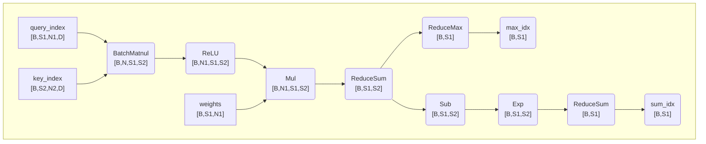

# aclnnDenseLightningIndexerSoftmaxLse

## 产品支持情况

|产品      | 是否支持 |
|:----------------------------|:-----------:|
|<term>Ascend 950PR/Ascend 950DT</term>|      ×     |
|<term>Atlas A3 训练系列产品</term>|      √     |
|<term>Atlas A2 训练系列产品 </term>|      √     |
|<term>Atlas 200I/500 A2 推理产品</term>|      ×     |
|<term>Atlas 推理系列产品</term>|      ×     |
|<term>Atlas 训练系列产品</term>|      ×     |

## 功能说明

- 算子功能：DenseLightningIndexerSoftmaxLse算子是DenseLightningIndexerGradKlLoss算子计算Softmax输入的一个分支算子。


- 计算公式：

$$
\text{res}=\text{AttentionMask}\left(\text{ReduceSum}\left(W\odot\text{ReLU}\left(Q_{index}@K_{index}^T\right)\right)\right)
$$

$$
\text{maxIndex}=\text{max}\left(res\right)
$$

$$
\text{sumIndex}=\text{ReduceSum}\left(\text{exp}\left(res-maxIndex\right)\right)
$$

maxIndex，sumIndex作为输出传递给算子DenseLightningIndexerGradKlLoss作为输入计算Softmax使用。


## 函数原型

算子执行接口为两段式接口，必须先调用“aclnnDenseLightningIndexerSoftmaxLseGetWorkspaceSize”接口获取入参并根据计算流程计算所需workspace大小，再调用“aclnnDenseLightningIndexerSoftmaxLse”接口执行计算。

```c++
aclnnStatus aclnnDenseLightningIndexerSoftmaxLseGetWorkspaceSize(
    const aclTensor *queryIndex,
    const aclTensor *keyIndex,
    const aclTensor *weight,
    const aclIntArray *actualSeqLengthsQueryOptional,
    const aclIntArray *actualSeqLengthsKeyOptional,
    char *layoutOptional,
    int64_t sparseMode,
    int64_t preTokens,
    int64_t nextTokens,
    const aclTensor *softmaxMaxOut,
    const aclTensor *softmaxSumOut,
    uint64_t *workspaceSize,
    aclOpExecutor **executor);
```

```c++
aclnnStatus aclnnDenseLightningIndexerSoftmaxLse(
    void *workspace,
    uint64_t workspaceSize,
    aclOpExecutor *executor,
    aclrtStream stream);
```

## aclnnDenseLightningIndexerSoftmaxLse

- **参数说明:**
  
    <table style="undefined;table-layout: fixed; width: 1550px">
        <colgroup>
            <col style="width: 220px">
            <col style="width: 120px">
            <col style="width: 300px">  
            <col style="width: 400px">  
            <col style="width: 212px">  
            <col style="width: 100px">
            <col style="width: 190px">
            <col style="width: 145px">
            </colgroup>
        <thead>
        <tr>
            <th>参数名</th>
            <th>输入/输出</th>
            <th>描述</th>
            <th>使用说明</th>
            <th>数据类型</th>
            <th>数据格式</th>
            <th>layout</th>
            <th>非连续Tensor</th>
        </tr></thead>
        <tbody>
        <tr>
            <td>queryIndex</td>
            <td>输入</td>
            <td>lightingIndexer结构的输入queryIndex。</td>
            <td>
            <ul>
                <li>B: 支持泛化且与query的B保持一致。</li>
                <li>S1: 支持泛化，不能为Matmul的M轴。</li>
                <li>Nidx1: 64、32、16、8。</li>
                <li>D: 128。</li>
                <li>T2: 多个Batch的S2累加。</li>
            </ul>
            </td>
            <td>FLOAT16、BFLOAT16</td>
            <td>ND</td>
            <td>(B,S1,Nidx1,D);(T1,Nidx1,D)</td>
            <td>√</td>
        </tr>
        <tr>
            <td>keyIndex</td>
            <td>输入</td>
            <td>lightingIndexer结构的输入keyIndex。</td>
            <td>
            <ul>
                <li>B: 支持泛化且与queryIndex的B保持一致。</li> 
                <li>S2: 支持泛化。</li>
                <li>Nidx2: 1。</li>
                <li>D: 128。</li>
                <li>T2: 多个Batch的S2累加。</li>
            </ul>
            </td>
            <td>FLOAT16、BFLOAT16</td>
            <td>ND</td>
            <td>(B,S2,Nidx2,D);(T2,Nidx2,D)</td>
            <td>√</td>
        </tr>
        <tr>
            <td>weights</td>
            <td>输入</td>
            <td>权重</td>
            <td>
            <ul>
                <li>B: 支持泛化且与queryIndex的B保持一致。</li>
                <li>S1: 支持泛化且与queryIndex的S1保持一致。</li>
                <li>Nidx1: 64、32、16、8。</li>
                <li>T1: 多个Batch的S1累加。</li>
            </ul>
            </td>
            <td>FLOAT16、BFLOAT16</td>
            <td>ND</td>
            <td>(B,S1,Nidx1);(T1,Nidx1)</td>
            <td>√</td>
        </tr>   
        <tr>
            <td>actualSeqLengthsQuery</td>
            <td>输入</td>
            <td>每个Batch中，Query的有效token数</td>
            <td>
            <ul>
                <li>值依赖。</li>
                <li>长度与B保持一致。</li>
                <li>累加和与T1保持一致。</li>
            </ul>
            </td>
            <td>INT64</td>
            <td>ND</td>
            <td>(B,)</td>
            <td>-</td>
        </tr>
        <tr>
            <td>actualSeqLengthsKey</td>
            <td>输入</td>
            <td>每个Batch中，Key的有效token数</td>
            <td>
            <ul>
                <li>值依赖。</li>
                <li>长度与B保持一致。</li>
                <li>累加和T2保持一致。</li>
            </ul>
            </td>
            <td>INT64</td>
            <td>ND</td>
            <td>(B,)</td>
            <td>-</td>
        </tr>
            <td>layout</td>
            <td>输入</td>
            <td>layout格式</td>
            <td>
            <ul>
                <li>仅支持BSND和TND格式。</li>
            </ul>
            </td>
            <td>STRING</td>
            <td>-</td>
            <td>-</td>
            <td>-</td>
        </tr>
        <tr>
            <td>sparseMode</td>
            <td>输入</td>
            <td>sparse的模式</td>
        <td>
              <ul>
                <li>表示sparse的模式。sparse不同模式的详细说明请参见<a href="#约束说明">约束说明</a>。</li>
                <li>仅支持模式3。</li>
              </ul>
        </td>
        <td>INT64</td>
        <td>-</td>
        <td>-</td>
        <td>-</td>
        </tr>
        <tr>
            <td>softmaxMaxOut</td>
            <td>输出</td>
            <td>softmax计算使用的max值</td>
            <td>
            <ul>
                <li>B: 支持泛化与queryIndex的B保持一致。</li>
                <li>Nidx2: 与keyIndex的Nidx2保持一致。</li>
                <li>S1:支持泛化，且与queryIndex的S1保持一致。</li>
                <li>T1: 多个Batch的S1累加。</li>
            </ul>
            </td>
            <td>FLOAT32</td>
            <td>ND</td>
            <td>(B,Nidx2,S1);(Nidx2,T1)</td>
            <td>√</td>
        </tr>
        <tr>
            <td>softmaxSumOut</td>
            <td>输出</td>
            <td>softmax计算使用的sum值</td>
            <td>
            <ul>
                <li>B: 支持泛化与query的B保持一致。</li>
                <li>Nidx2: 与keyIndex的Nidx2保持一致。</li>
                <li>S1:支持泛化，且与queryIndex的S1保持一致。</li>
                <li>T1: 多个Batch的S1累加。</li>
            </ul>
            </td>
            <td>FLOAT32</td>
            <td>ND</td>
            <td>(B,Nidx2,S1);(Nidx2,T1)</td>
            <td>√</td>
        </tr>
        </tbody>
    </table>
    
- **返回值：**

    返回aclnnStatus状态码，具体参见[aclnn返回码](../../../docs/context/aclnn返回码.md)。

    第一段接口完成入参校验，出现以下场景时报错：

    <table style="undefined;table-layout: fixed;width: 1155px"><colgroup>
    <col style="width: 319px">
    <col style="width: 144px">
    <col style="width: 671px">
    </colgroup>
        <thead>
            <th>返回值</th>
            <th>错误码</th>
            <th>描述</th>
        </thead>
        <tbody>
            <tr>
                <td>ACLNN_ERR_PARAM_NULLPTR</td>
                <td>161001</td>
                <td>必选参数或者输出是空指针。</td>
            </tr>
            <tr>
                <td>ACLNN_ERR_PARAM_INVALID</td>
                <td>161002</td>
                <td>queryIndex、keyIndex、weights等输入变量的数据类型和数据格式不在支持的范围内。</td>
            </tr>
            <tr>
                <td>ACLNN_ERR_RUNTIME_ERROR</td>
                <td>361001</td>
                <td>API内存调用npu runtime的接口异常。</td>
            </tr>
        </tbody>
    </table>

## aclnnDenseLightningIndexerSoftmaxLse

- **参数说明：**

    <table style="undefined;table-layout: fixed; width: 1155px"><colgroup>
    <col style="width: 144px">
    <col style="width: 125px">
    <col style="width: 700px">
    </colgroup>
    <thead>
        <tr>
        <th>参数名</th>
        <th>输入/输出</th>
        <th>描述</th>
        </tr></thead>
    <tbody>
        <tr>
        <td>workspace</td>
        <td>输入</td>
        <td>在Device侧申请的workspace内存地址。</td>
        </tr>
        <tr>
        <td>workspaceSize</td>
        <td>输入</td>
        <td>在Device侧申请的workspace大小，由第一段接口aclnnSparseLightningIndexerKLLossGetWorkspaceSize获取。</td>
        </tr>
        <tr>
        <td>executor</td>
        <td>输入</td>
        <td>op执行器，包含了算子计算流程。</td>
        </tr>
        <tr>
        <td>stream</td>
        <td>输入</td>
        <td>指定执行任务的AscendCL stream流。</td>
        </tr>
    </tbody>
    </table>

- **返回值：**

    返回aclnnStatus状态码，具体参见[aclnn返回码](../../../docs/context/aclnn返回码.md)。


## 约束说明

- 公共约束
    - 入参为空的场景处理：
        - queryIndex为空Tensor：直接返回。
        - SFAG公共约束里入参为空的场景和FAG保持一致。
    <table style="undefined;table-layout: fixed; width: 942px"><colgroup>
        <col style="width: 100px">
        <col style="width: 740px">
        <col style="width: 360px">
        </colgroup>
        <thead>
            <tr>
                <th>sparseMode</th>
                <th>含义</th>
                <th>备注</th>
            </tr>
        </thead>
        <tbody>
        <tr>
            <td>0</td>
            <td>defaultMask模式，如果attenmask未传入则不做mask操作，忽略preTokens和nextTokens；如果传入，则需要传入完整的attenmask矩阵，表示preTokens和nextTokens之间的部分需要计算</td>
            <td>不支持</td>
        </tr>
        <tr>
            <td>1</td>
            <td>allMask，必须传入完整的attenmask矩阵</td>
            <td>不支持</td>
        </tr>
        <tr>
            <td>2</td>
            <td>leftUpCausal模式的mask，需要传入优化后的attenmask矩阵</td>
            <td>不支持</td>
        </tr>
        <tr>
            <td>3</td>
            <td>rightDownCausal模式的mask，对应以右顶点为划分的下三角场景，需要传入优化后的attenmask矩阵</td>
            <td>支持</td>
  </tr>
        <tr>
            <td>4</td>
            <td>band模式的mask，需要传入优化后的attenmask矩阵</td>
            <td>不支持</td>
        </tr>
        <tr>
            <td>5</td>
            <td>prefix</td>
            <td>不支持</td>
        </tr>
        <tr>
            <td>6</td>
            <td>global</td>
            <td>不支持</td>
        </tr>
        <tr>
            <td>7</td>
            <td>dilated</td>
            <td>不支持</td>
        </tr>
        <tr>
            <td>8</td>
            <td>block_local</td>
            <td>不支持</td>
        </tr>
        </tbody>
    </table>

- 规格约束

    <table style="undefined;table-layout: fixed; width: 942px"><colgroup>
        <col style="width: 100px">
        <col style="width: 300px">
        <col style="width: 360px">
        </colgroup>
        <thead>
            <tr>
                <th>规格项</th>
                <th>规格</th>
                <th>规格说明</th>
            </tr>
        </thead>
        <tbody>
        <tr>
            <td>B</td>
            <td>1~256</td>
            <td>-</td>
        </tr>
        <tr>
            <td>S1、S2</td>
            <td>1~128K</td>
            <td>S1、S2支持不等长</td>
        </tr>
        <tr>
            <td>Nidx1</td>
            <td>8、16、32、64</td>
            <td>SparseFA为MQA。</td>
        </tr>
        <tr>
            <td>Nidx2</td>
            <td>1</td>
            <td>SparseFA为MQA，N2=1。</td>
        </tr>
        <tr>
            <td>D</td>
            <td>128</td>
            <td>query与query_index的D不同。</td>
        </tr>
        <tr>
            <td>layout</td>
            <td>BSND/TND</td>
            <td>-</td>
        </tr>
        </tbody>
    </table>
- 典型值
  
    <table style="undefined;table-layout: fixed; width: 942px"><colgroup>
        <col style="width: 100px">
        <col style="width: 660px">
        </colgroup>
        <thead>
            <tr>
                <th>规格项</th>
                <th>典型值</th>
            </tr>
        </thead>
        <tbody>
        <tr>
            <td>queryIndex</td>
            <td>N1 = 64/32;  D = 128 ; S1 = 64k/128k</td>
        </tr>
        <tr>
            <td>keyIndex</td>
            <td>D = 128。</td>
        </tr>
        </tbody>
    </table>

## 计算图


算子具体的流程图的变量传递如所示。

- 计算max_index,sum_index



## 附录

#### 1. 缓存机制

使用缓存机制。


#### 2. 归属领域

- 该算子归属领域为：aclnnop_ops_train（NN网络算子训练库）。
- 领域之间的依赖关系如下：推理库（aclnnop_ops_infer）依赖数学库（aclnnop_math），训练库（aclnnop_ops_train）依赖推理库（aclnnop_ops_infer）。
    <!-- 可选领域：
    aclnnop_ops_infer，NN网络算子推理库；
    aclnnop_ops_train，NN网络算子训练库；
    aclnnop_math，数学算子库；
    aclnnop_sparse，稀疏算子库；
    aclnnop_fft，傅里叶变换算子库；
    aclnnop_rand，随机数算子库； -->

#### 3. Pytorch AtenIR

```c++
npu_dense_lightning_indexer_softmax_lse(Tensor query_index, Tensor key_index, Tensor weights, int[]? actual_seq_qlen=None, int[]? actual_seq_kvlen=None, str? layout="BSND", int? sparse_mode=3, int? pre_tokens=9223372036854775807, int? next_tokens=9223372036854775807) -> (Tensor, Tensor)
参考：
aclnnStatus aclnnDenseLightningIndexerSoftmaxLseGetWorkspaceSize(
    const aclTensor *queryIndex, const aclTensor *keyIndex, const aclTensor *weights, const aclIntArray *actualSeqLengthsQueryOptional,
    const aclIntArray *actualSeqLengthsKeyOptional, char *layoutOptional, int64_t sparseMode, int64_t preTokens, int64_t nextTokens,
    const aclTensor *softmaxMaxOut, const aclTensor *softmaxSumOut, uint64_t *workspaceSize, aclOpExecutor **executor);
```

#### 4.  AtenIR参数描述

<table style="undefined;table-layout: fixed; width: 1550px">
        <colgroup>
            <col style="width: 220px">
            <col style="width: 120px">
            <col style="width: 300px">  
            <col style="width: 212px">  
            <col style="width: 212px">  
            </colgroup>
        <thead>
        <tr>
            <th>类型</th>
            <th>参数名</th>
            <th>描述</th>
            <th>GPU支持的数据类型</th>
            <th>CPU支持的数据类型</th>
        </tr></thead>
        <tbody>
        <tr>
            <td>输入</td>
            <td>queryIndex</td>
            <td>topk产生的query_index</td>
            <td>FLOAT16、BFLOAT16</td>
            <td>FLOAT16、BFLOAT16</td>
        </tr>
        <tr>
            <td>输入</td>
            <td>keyIndex</td>
            <td>topk产生的key_index</td>
            <td>FLOAT16、BFLOAT16 </td>
            <td>FLOAT16、BFLOAT16 </td>
        </tr>
        <tr>
            <td>输入</td>
            <td>weights</td>
            <td>权重</td>
            <td>FLOAT16、BFLOAT16</td>
            <td>FLOAT16、BFLOAT16</td>
        </tr>   
        <tr>
            <td>输入（intarray）</td>
            <td>actualSeqLengthsQuery</td>
            <td>每个Batch中，query index的有效token数</td>
            <td>INT64</td>
            <td>INT64</td>
        </tr>
        <tr>
            <td>输入（intarray）</td>
            <td>actualSeqLengthsKey</td>
            <td>每个Batch中，key index的有效token数</td>
            <td>INT64</td>
            <td>INT64</td>
        </tr>
        <tr>
            <td>属性</td>
            <td>layout</td>
            <td>layout格式</td>
            <td>STRING</td>
            <td>STRING</td>
        </tr>
        <tr>
            <td>属性</td>
            <td>sparseMode</td>
            <td>sparse的模式</td>
        <td>INT64</td>
        <td>INT64</td>
        </tr>
        <tr>
            <td>属性</td>
            <td>pre_tokens</td>
            <td>Attention算子里, 对S矩阵的滑窗起始位置。</td>
        <td>INT64</td>
        <td>INT64</td>
        </tr>
        <tr>
            <td>属性</td>
            <td>next_tokens</td>
            <td>Attention算子里, 对S矩阵的滑窗终止位置。</td>
        <td>INT64</td>
        <td>INT64</td>
        </tr>
        <tr>
            <td>输出</td>
            <td>softmaxMaxOut</td>
            <td>softmax计算使用的max值</td>
            <td>FLOAT32</td>
            <td>FLOAT32</td>
        </tr>
        <tr>
            <td>输出</td>
            <td>softmaxSumOut</td>
            <td>softmax计算使用的sum值</td>
            <td>FLOAT32</td>
            <td>FLOAT32</td>
        </tr>
        </tbody>
    </table>
#### HostAPI接口约束

<table style="undefined;table-layout: fixed; width: 1550px">
        <colgroup>
            <col style="width: 120px">
            <col style="width: 400px">
            <col style="width: 400px">  
            </colgroup>
        <thead>
        <tr>
            <th>功能维度</th>
            <th>已支持</th>
            <th>应支持但未支持</th>
        </tr></thead>
        <tbody>
        <tr>
            <td>数据类型</td>
            <td>FLOAT16、BFLOAT16、INT64、INT32</td>
            <td></td>
        </tr>
        <tr>
            <td>数据格式</td>
            <td>ND</td>
            <td>NA</td>
        </tr>
        <tr>
            <td>空Tensor</td>
            <td>支持空进空出</td>
            <td>NA</td>
        </tr>
        <tr>
            <td>非连续Tensor</td>
            <td>支持输入非连续、支持输出非连续</td>
            <td>NA</td>
        </tr>
        </tbody>
    </table>
边界值场景说明：

1、当输入数据为nan时，输出也为nan。
2、当计算结果超过数据类型的数据范围时：浮点类型计算结果为inf，整形计算结果为会出现反转。

- HostAPI异常处理


以下场景会出现参数校验异常：
1、传入的query_index、key_index、weights是空指针时。
2、输入或者属性变量，如：query_index、key_index、weights……的数据类型和数据格式不在支持的范围之内。
3、输入类型不匹配，例如query_index和key_indexdtype不一样。
4、输入数据layout不一致。
5、shape不满足约束条件。
6、actualSeqLengthsQuery大于actualSeqLengthsKey相同索引位置的值。 
7、当layout == BSND时，S1的值大于S2。

- 兼容性说明

1、功能兼容性：兼容 Pytorch/TensorFlow/MindSpore/Onnx 框架定义；
2、平台兼容性：已支持的芯片版本，功能无差异；
3、接口兼容性：新增接口；
4、行为兼容性：新增接口；
5、性能兼容性：新增接口；
6、资源兼容性：新增接口；
7、错误处理兼容性：新增接口；