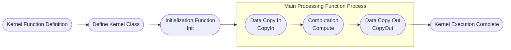

# AI Core Operator Development Guide

## Overview

> **Note:**
>
> 1. For basic concepts involved in operator development such as Tiling, Kernel, and hardware architecture, refer to [Ascend C Operator Development](https://www.hiascend.com/document/detail/en/CANNCommunityEdition/latest/programug/Ascendcopdevg/atlas_ascendc_map_10_0002.html). For interfaces involved, refer to [Ascend C Operator Development Interface](https://www.hiascend.com/document/detail/en/CANNCommunityEdition/latest/API/ascendcopapi/atlasascendc_api_07_0003.htmli) and [Basic Data Structures and Interfaces](https://www.hiascend.com/document/detail/en/CANNCommunityEdition/latest/maintenref/basicdataapi/atlasopapi_07_00001.html).
> 2. AI Core operators are developed using the Ascend C language and run on the AI Core hardware unit.
> 3. For operators contributed based on the [Ascend/samples](https://gitee.com/ascend/samples/tree/master) repository, refer to [Appendix > Operator Project Migration](#operator-project-migration) to complete the migration of existing operators to this project.
> 4. build.sh: Commands involved in operator development can be viewed through `bash build.sh --help`. For function parameter introduction, refer to [build Parameter Description](../context/build.md).

This development guide uses the `AddExample` operator development as an example to introduce the new operator development process and the deliverables involved. For complete sample code, visit the project `examples` directory.

1. [Project Creation](#project-creation): Before developing operators, complete environment deployment and create the operator directory for subsequent operator compilation and deployment.

2. [Operator Definition](#operator-definition): Determine the operator function and prototype definition.

3. [Tiling Implementation](#tiling-implementation): Implement the Host-side operator Tiling function.

4. [Kernel Implementation](#kernel-implementation): Implement the Device-side operator kernel function.

5. [aclnn Adaptation](#aclnn-adaptation): Custom operators are recommended to use the aclnn interface for invocation, requiring binary release to be completed first. **If using graph mode to invoke operators**, refer to [Graph Mode Adaptation Guide](./graph_develop_guide.md).

6. [Compile and Deploy](#compile-and-deploy): Complete custom operator compilation and installation through the project compilation script.

7. [Operator Verification](#operator-verification): Verify custom operator functionality through common operator invocation methods.

## Project Creation

**1. Environment Deployment**

Before developing operators, complete the basic environment setup by referring to [Environment Deployment](../context/quick_install.md).

**2. Directory Creation**

Directory creation is an important step in operator development, providing a unified directory structure and file organization for subsequent code writing, compilation, and debugging.

You can quickly create the operator directory through `build.sh`. Enter the project root directory and execute the following command:

```bash
# Create the specified operator directory, such as bash build.sh --genop=examples/add_example
# ${op_class} represents the operator category, such as attention.
# ${op_name} represents the lowercase underscore form of the operator name, such as the `AddExample` operator corresponding to add_example. New operators must not have the same name as existing operators.
bash build.sh --genop=${op_class}/${op_name}
```

After successful command execution, you will see the following prompt:

```bash
Create the initial directory for ${op_name} under ${op_class} success
```

After creation, the directory structure is as follows:

```text
${op_name}                              # Replace with the lowercase underscore form of the actual operator name
├── examples                            # Operator invocation samples
│   ├── test_aclnn_${op_name}.cpp       # Operator aclnn invocation sample
├── op_host                             # Host-side implementation
│   ├── ${op_name}_def.cpp              # Operator information library, defining basic operator information such as name, input/output, and data types
│   ├── ${op_name}_infershape.cpp       # InferShape implementation, implementing operator shape derivation, deriving output shape at runtime
│   ├── ${op_name}_tiling.cpp           # Tiling implementation, dividing tensors into multiple small blocks, distinguishing data types for parallel computation
│   └── CMakeLists.txt                  # Host-side cmakelist file
└── op_kernel                           # Device-side Kernel implementation
│   ├── ${op_name}_tiling_key.h         # Tilingkey file, defining the Key of the Tiling strategy, identifying different partitioning methods
│   ├── ${op_name}_tiling_data.h        # Tilingdata file, storing configuration data related to the Tiling strategy, such as block size and parallelism
│   ├── ${op_name}.cpp                  # Kernel entry file, containing main function and scheduling logic
│   └── ${op_name}.h                    # Kernel implementation file, defining Kernel header file, including function declarations, structure definitions, and logic implementation
├── tests                               # UT implementation
│   ├── ut                              # tiling/kernel/aclnn UT implementation
└── CMakeLists.txt                      # Operator cmakelist entry
```

If `${op_class}` is a brand-new operator category, you need to additionally add `add_subdirectory(${op_class})` in `cmake/custom_build.cmake`, otherwise it cannot compile normally. The specific modification is as follows.

```bash
# Compile operators in the examples directory
foreach(EXAMPLES_OP_NAME ${ASCEND_OP_NAME})
    set(EXAMPLES_DIR "${OPS_TRANSFORMER_DIR}/examples/${EXAMPLES_OP_NAME}")
    set(EXAMPLES_MC2_DIR "${OPS_TRANSFORMER_DIR}/examples/mc2/${EXAMPLES_OP_NAME}")
    # When adding a new operator category in the examples directory, add command statements following the mc2 directory pattern as follows:
    # set(EXAMPLES_${op_class}_DIR "${OPS_TRANSFORMER_DIR}/examples/${op_class}/${EXAMPLES_OP_NAME}")
    if(IS_DIRECTORY ${EXAMPLES_DIR})
        add_subdirectory(examples/${EXAMPLES_OP_NAME})
        list(APPEND OP_DIR_LIST ${CMAKE_CURRENT_SOURCE_DIR}/examples/${EXAMPLES_OP_NAME})
    elseif(IS_DIRECTORY ${EXAMPLES_MC2_DIR})
        add_subdirectory(examples/mc2/${EXAMPLES_OP_NAME})
        list(APPEND OP_DIR_LIST ${CMAKE_CURRENT_SOURCE_DIR}/examples/mc2/${EXAMPLES_OP_NAME})
    # When adding a new operator category in the examples directory, add command statements following the mc2 directory pattern as follows:
    # elseif(IS_DIRECTORY ${EXAMPLES_${op_class}_DIR})
    #     add_subdirectory(examples/${op_class}/${EXAMPLES_OP_NAME}")
    #     list(APPEND OP_DIR_LIST ${CMAKE_CURRENT_SOURCE_DIR}/examples/${op_class}/${EXAMPLES_OP_NAME})
    endif()
endforeach()
```

```bash
# Compile operators in the experimental directory
if(ENABLE_EXPERIMENTAL)
    # genop adds new experimental operator category
    # add_subdirectory(${op_class})
    add_subdirectory(experimental/attention)
else()
    # genop adds new non-experimental operator category
    # add_subdirectory(${op_class})
    add_subdirectory(attention)
endif()
```

## Operator Definition

Operator definition requires completing two deliverables: `README.md` and `${op_name}_def.cpp`

**Deliverable 1: README.md**

Before developing an operator, determine the target operator's function and computation logic first.

Using the custom `AddExample` operator as an example, refer to [AddExample Operator Description](../../../examples/add_example/README.md).

**Deliverable 2: ${op_name}_def.cpp**

Operator information library.

Using the custom `AddExample` operator as an example, refer to [AddExample Operator Information Library](../../../examples/add_example/op_host/add_example_def.cpp).

## Tiling Implementation

### Tiling Introduction

Since the AI Core internal storage space in the NPU is limited and cannot load the entire tensor data into the computation unit at once, the input tensor needs to be divided into multiple small blocks (Tiles) for block-by-block computation. This process is called Tiling.

The algorithm used to guide data partitioning is called the Tiling strategy or Tiling algorithm, which determines how to divide the input data into multiple computation blocks and guides the Kernel on how to allocate memory and schedule computation tasks. Tiling and Kernel communicate information through the `TilingData` structure.

### Code Implementation

Tiling requires three deliverables: `${op_name}_tiling.cpp`, `${op_name}_tiling_key.h`, and `${op_name}_tiling_data.h`

> Note:
>
> 1. `${op_name}_tiling.cpp` is placed in the `${op_name}/op_host` directory;
> 2. `${op_name}_tiling_key.h` and `${op_name}_tiling_data.h` are placed in the `${op_name}/op_kernel` directory;
> 3. If `${op_name}_tiling.cpp` needs to reference `${op_name}_tiling_data.h`, use relative path format, for example: `#include "../op_kernel/${op_name}_tiling_data.h"`.

**Deliverable 1: ${op_name}_tiling.cpp**

Tiling main partitioning logic.

For detailed implementation, refer to [add_example_tiling.cpp](../../../examples/add_example/op_host/add_example_tiling.cpp).

> **Explanation of empty function implementations in the sample:**
>
> 1. **TilingParse**: Graph mode standard deliverable, retaining function definition to meet framework invocation specification. Can be left empty when there is no actual logic.
> 2. **CompileInfo**: Graph mode standard deliverable, retaining function definition to meet framework invocation specification. Can be left empty when there is no actual logic.

```CPP
// ${op_name}_tiling.cpp
// 1. Tiling needs to obtain runtime environment information, including available core count and UB (Unified Buffer) size, and pass the obtained information to CompileInfo. Auto-generated aclnn does not call this function; directly return ge::GRAPH_SUCCESS.
static ge::graphStatus TilingParse(gert::TilingParseContext* context)
{
    return ge::GRAPH_SUCCESS;
    // If writing the aclnn interface manually, complete the parse function following the steps below
    // // 1.1 Get environment information
    // auto compileInfo = context->GetCompiledInfo<CompileInfo>();
    // OP_CHECK_NULL_WITH_CONTEXT(context, compileInfo);
    // auto platformInfo = context->GetPlatformInfo();
    // auto ascendcPlatform = platform_ascendc::PlatformAscendC(platformInfo);
    // // 1.2 Get available core count
    // compileInfo->totalCoreNum = ascendcPlatform.GetCoreNumAiv();
    // // 1.3 Get UB size
    // uint64_t ubSizePlatForm;
    // ascendcPlatform.GetCoreMemSize(platform_ascendc::CoreMemType::UB, ubSizePlatForm);
    // compileInfo->ubSize = static_cast<int64_t>(ubSizePlatForm);
    // ...
    // return ge::GRAPH_SUCCESS;
}

// 2. Tiling computation main entry
static ge::graphStatus TilingFunc(gert::TilingContext* context){
    // 2.1 Get platform information
    uint64_t ubSize;
    int64_t coreNum;
    OP_CHECK_IF(
        GetPlatformInfo(context, ubSize, coreNum) != ge::GRAPH_SUCCESS, OP_LOGE(context, "GetPlatformInfo error"),
        return ge::GRAPH_FAILED);
    
    // 2.2 Get input information
    // Get input tensor shape information
    auto inputX = context->GetInputShape(0);
    OP_CHECK_NULL_WITH_CONTEXT(context, inputX);

    // If input shape is scalar, convert to {1}; otherwise keep original shape unchanged
    auto inputShapeX = EnsureNotScalar(inputX->GetStorageShape());

    // Get input tensor description information
    auto inputDesc = context->GetInputDesc(0);
    OP_CHECK_NULL_WITH_CONTEXT(context, inputDesc);

    // Get data type
    dataType = inputDesc->GetDataType();

    // 2.3 Calculate Tiling parameters (design according to different operator functions)
    ...

    // 2.4 Set TilingData information
    ${op_name}TilingData* tiling = context->GetTilingData<${op_name}TilingData>();
    OP_CHECK_NULL_WITH_CONTEXT(context, tiling);
    OP_CHECK_IF(
        memset_s(tiling, sizeof(${op_name}TilingData), 0, sizeof(${op_name}TilingData)) != EOK,
        OP_LOGE(context, "set tiling data error"), return ge::GRAPH_FAILED);
    tiling->totalLength = totalIdx;
    tiling->tileNum = TILE_NUM;

    // 2.5 Set WorkspaceSize (optional)
    size_t* currentWorkspace = context->GetWorkspaceSizes(1);
    OP_CHECK_NULL_WITH_CONTEXT(context, currentWorkspace);
    currentWorkspace[0] = WS_SYS_SIZE;
}

// 3. Tiling registration entry
IMPL_OP_OPTILING(${op_name}).Tiling(TilingFunc).TilingParse<CompileInfo>(TilingParse);
```

**Deliverable 2: ${op_name}_tiling_key.h**

TilingKey is a method within an operator to distinguish different implementations by partitioning kernel code. The kernel side can select different algorithm logic through TilingKey.

For detailed implementation, refer to [add_example_tiling_key.h](../../../examples/add_example/op_kernel/add_example_tiling_key.h).

> **Note:** For implementing complex parameter combinations to complete branch selection (involving multiple TilingKey scenarios), refer to [Ascend C Operator Development Interface](https://www.hiascend.com/document/detail/en/canncommercial/latest/API/appdevgapi/aclcppdevg_03_0005.html) in "Utils API > Tiling Template Programming > Template Parameter Meaning".

```CPP
// ${op_name}_tiling_key.h
ASCENDC_TPL_ARGS_DECL(
    ${op_name},
    ASCENDC_TPL_UINT_DECL(schMode, 1, ASCENDC_TPL_UI_LIST, ELEMENTWISE_TPL_SCH_MODE_0, ELEMENTWISE_TPL_SCH_MODE_1));

ASCENDC_TPL_SEL(ASCENDC_TPL_ARGS_SEL(
    ASCENDC_TPL_UINT_SEL(schMode, ASCENDC_TPL_UI_LIST, ELEMENTWISE_TPL_SCH_MODE_0, ELEMENTWISE_TPL_SCH_MODE_1)));
```

**Deliverable 3: ${op_name}_tiling_data.h**

Parameters related to the partitioning algorithm, such as total data size and number of data blocks per core, stored through a structure.

For detailed implementation, refer to [add_example_tiling_data.h](../../../examples/add_example/op_kernel/add_example_tiling_data.h).

```CPP
// ${op_name}_tiling_data.h
struct ${op_name}TilingData {
    int64_t totalLength;
    int64_t tileNum;
};
```

## Kernel Implementation

### Kernel Introduction

Kernel is the core part of operator execution on the NPU, responsible for tensor data loading, computation, and storage. It is the final carrier of operator function implementation. Kernel implementation needs to closely cooperate with the Tiling strategy, performing memory allocation and computation scheduling based on the `TilingData` and `TilingKey` information provided by Tiling.

Kernel implementation includes the following steps. The entire process is connected through the `Process` function, implementing the complete operator flow.



### Code Implementation

Kernel requires two deliverables: `${op_name}.cpp` and `${op_name}.h`

> Note:
>
> 1. `${op_name}.cpp` is the kernel entry function and must be placed in the `${op_name}/op_kernel` directory;
> 2. `${op_name}.h` file can be placed in corresponding directories according to different SoC or templates, such as `${op_name}/op_kernel/arch32`, `${op_name}/op_kernel/arch35`, or `${op_name}/op_kernel/impl` directories;

**Deliverable 1: ${op_name}.cpp**

Kernel entry file, containing main function and scheduling logic.

For detailed implementation, refer to [add_example.cpp](../../../examples/add_example/op_kernel/add_example.cpp).

```CPP
// 1. Kernel function definition
// schMode is a template parameter used to support computation paths for different data types (such as float and int32)
// __global__ __aicore__ indicates this function is a global function that can execute on AI Core
template <uint32_t schMode>
__global__ __aicore__ void add_example(GM_ADDR x, GM_ADDR y, GM_ADDR z, GM_ADDR workspace, GM_ADDR tiling){
    ....
    // Tiling registration entry
    REGISTER_TILING_DEFAULT(AddExampleTilingData);

    // Macro method to get TilingData
    GET_TILING_DATA_WITH_STRUCT(AddExampleTilingData, tilingData, tiling);

    // Instantiate Kernel object based on TilingKey and complete computation
    if constexpr (schMode == static_cast<uint32_t>(AddExampleTilingKey::TILING_KEY_EXAMPLE_FLOAT)) { // float data type takes this branch
        NsAddExample::AddExample<float> op;     // Operator Kernel instance acquisition
        op.Init(x, y, z, &tilingData);          // Operator Kernel instance initialization
        op.Process();                           // Operator Kernel instance execution
    }
    ....
}
```

**Deliverable 2: ${op_name}.h**

Define Kernel header file, including function declarations, structure definitions, logic implementation, and so on.

For detailed implementation, refer to [add_example.h](../../../examples/add_example/op_kernel/add_example.h).

```C++
// 2. Define Kernel class
template <typename T>
class AddExample
{
public:
    // Default constructor, __aicore__ indicates this function runs on AI Core
    __aicore__ inline AddExample(){};     
    // Initialization function, used to set input/output addresses and Tiling partitioning information computation
    __aicore__ inline void Init(GM_ADDR x, GM_ADDR y, GM_ADDR z, const AddExampleTilingData* tilingData);
    // Main processing function, executing data copy and computation
    __aicore__ inline void Process();

private:
    // Function to copy data from GM to LM
    __aicore__ inline void CopyIn(int32_t progress);
    // Function to copy data from LM to GM
    __aicore__ inline void CopyOut(int32_t progress);
    // Function to execute computation, datalength represents the current processing data length
    __aicore__ inline void Compute(const int32_t dataLength);

private:
    // Pipeline object, used to manage data flow (copy and computation pipeline)
    TPipe pipe_;
    // Input queue X, copied from GM to LM, BUFFER_NUM represents buffer count, enabling double buff for pipeline parallelism, value is 2
    TQue<QuePosition::VECIN, BUFFER_NUM> inputQueueX_;
    // Input queue Y, copied from GM to LM, BUFFER_NUM represents buffer count, enabling double buff for pipeline parallelism, value is 2
    TQue<QuePosition::VECIN, BUFFER_NUM> inputQueueY_;
    // Output queue Z, copied from LM to GM, BUFFER_NUM represents buffer count, enabling double buff for pipeline parallelism, value is 2
    TQue<QuePosition::VECOUT, BUFFER_NUM> outputQueueZ_;

    // Input X GM address
    GlobalTensor<T> inputGMX_;
    // Input Y GM address
    GlobalTensor<T> inputGMY_;
    // Input Z GM address
    GlobalTensor<T> outputGMZ_;
    
    // Total data length
    int64_t blockLength_ = 0;
    // Number of blocks each block is divided into
    int64_t tileNum_ = 0;
    // Data length processed by each tile
    int64_t tileLength_ = 0;
    ...
};

// 3. Initialization function Init
template <typename T>
__aicore__ inline void AddExample<T>::Init(GM_ADDR x, GM_ADDR y, GM_ADDR z, const AddExampleTilingData* tilingData)
{
    // 3.1 Initialize member variables
    blockLength_ = tilingData->totalLength / AscendC::GetBlockNum();
    ...
    // 3.2 Initialize GM addresses
    inputGMX.SetGlobalBuffer((__gm__ T*)x + blockLength_ * AscendC::GetBlockIdx(), blockLength_);
    ...
    // 3.3 Initialize queue lengths
    pipe.InitBuffer(inputQueueX_, BUFFER_NUM, tileLength_ * sizeof(T));
    ...
}

// 4. Main processing function Process
template <typename T>
__aicore__ inline void AddExample<T>::Process()
{
    // Calculate the current core data processing loop count
    int32_t loopCount = tileNum_ * BUFFER_NUM;
    for (int32_t i = 0; i < loopCount; i++) {
        CopyIn(i);              // Data copy in
        Compute(i);             // Computation
        CopyOut(i);             // Data copy out
    }
}
...
```

## aclnn Adaptation

After operator development and compilation are completed, the aclnn interface (a set of C-based APIs) is automatically generated, which can be directly invoked in applications to call operators.

To implement this invocation method, the operator's corresponding binary package needs to be generated first. This project does not require manual configuration; the operator binary package is automatically generated through ${op_name}_def.cpp, supporting developers to use it directly.

## Compile and Deploy

After operator development is completed, compile the operator project to generate a custom operator installation package *.run. The specific operations are as follows:

1. **Preparation.**

    Complete the basic environment setup by referring to [Project Creation](#project-creation), and check whether the operator development deliverables are complete and in the corresponding operator category directory.

2. **Compile Custom Operator Package.**

    Using the `AddExample` operator as an example, assuming the development deliverables are in the `examples` directory. For complete code, refer to the [add_example](../../../examples/add_example) directory.

    > Note: The compilation process depends on third-party open-source software. In networked scenarios, it will be downloaded automatically. In offline compilation scenarios, you need to install it yourself. For details, refer to [Offline Compilation](../invocation/quick_op_invocation.md#offline-compilation).

    ```bash
    # Compile specified operator, such as bash build.sh --pkg --ops=add_example
    bash build.sh --pkg --soc=${soc_version} --vendor_name=${vendor_name} --ops=${op_list} [--experimental]
    ```

    - --soc: ${soc_version} represents the NPU model. Atlas A2 series products use "ascend910b" (default), Atlas A3 series products use "ascend910_93", Ascend 950PR/Ascend 950DT products use "ascend950".
    - --vendor_name (optional): ${vendor_name} represents the name of the custom operator package being built, default name is custom.
    - --ops (optional): ${op_list} represents the operators to be compiled. When not specified, all operators are compiled by default. The format is like "--ops=add_example".
    - --experimental (optional): If the compiled operator is a contributed operator, configure --experimental.

    When the following message appears, the compilation is successful:

    ```bash
    Self-extractable archive "cann-ops-transformer-${vendor_name}_linux-${arch}.run" successfully created.
    ```

3. **Install Custom Operator Package.**

    ```bash
    # Install run package
    ./build_out/cann-ops-transformer-${vendor_name}_linux-${arch}.run
    ```

    The custom operator package is installed in the `${ASCEND_HOME_PATH}/opp/vendors` path. `${ASCEND_HOME_PATH}` represents the CANN software installation directory, which can be configured in environment variables in advance.

4. **(Optional) Delete Custom Operator Package.**

    Note that custom operator packages do not support uninstallation. If uninstallation is needed, delete the vendors/${vendor_name} directory and delete the load_priority configuration item corresponding to ${vendor_name} in vendors/config.ini.

## Operator Verification

Before verifying the operator, ensure environment variables have been configured. The command is as follows:

```bash
export LD_LIBRARY_PATH=${ASCEND_HOME_PATH}/opp/vendors/${vendor_name}_transformer/op_api/lib:${LD_LIBRARY_PATH}
```

- **UT Verification**

  During operator development, you can quickly verify through UT verification (such as Tiling). For detailed implementation, refer to [Tiling UT](../../../examples/add_example/tests/ut/op_host/test_add_example_tiling.cpp). For commands to execute UT verification, refer to [Operator Invocation](../invocation/quick_op_invocation.md).
  
- **aclnn Invocation Verification**

  After the developed operator completes compilation and deployment, verify functionality through the aclnn method. For the method, refer to [Operator Invocation Methods](../invocation/op_invocation.md).

## Appendix

### Operator Project Migration

Since the [Ascend/samples](https://gitee.com/ascend/samples/tree/master) project differs from this project (refer to [Project Creation](#project-creation)), the operator implementation deliverables and quantities are different. Refer to the table below to migrate operator samples in the `operator` directory.

<table border="1">
  <tr>
    <th>Ascend/samples</th>
    <th>This Project</th>
    <th>Migration Method</th>
    <th>Code Sample</th>
  </tr>
  <tr>
    <td rowspan="4">op_host/{op_name}.cpp</td>
    <td>op_host/{op_name}_def.cpp</td>
    <td>Separate the operator prototype description part from the original op_host/{op_name}.cpp</td>
    <td><a href="#op_host/{op_name}_def.cpp">op_host/{op_name}_def.cpp</a>
    </td>
  </tr>
  <tr>
    <td>op_host/{op_name}_infershape.cpp</td>
    <td>(Optional) Separate the shape derivation part from the original op_host/{op_name}.cpp</td>
    <td><a href="#op_host/{op_name}_infershape.cpp">op_host/{op_name}_infershape.cpp</a>
    </td>
  </tr>
  <tr>
    <td>op_host/{op_name}_tiling.cpp</td>
    <td>Only retain TilingFunc from the original op_host/{op_name}.cpp</td>
    <td><a href="#op_host/{op_name}_tiling.cpp">op_host/{op_name}_tiling.cpp</a></td>
  </tr>
  <tr>
    <td>op_graph/{op_name}_graph_infer.cpp</td>
    <td>(Optional) Separate the type derivation part from the original op_host/{op_name}.cpp</td>
    <td><a href="#op_graph/{op_name}_graph_infer.cpp">op_graph/{op_name}_graph_infer.cpp</a></td>
  </tr>
  <tr>
    <td>op_host/{op_name}_tiling.h</td>
    <td>op_kernel/{op_name}_tiling_data.h</td>
    <td>Change the macro-defined Tiling structure definition in the original op_host directory to C++ standard definition</td>
    <td><a href="#op_kernel/{op_name}_tiling_data.h">op_kernel/{op_name}_tiling_data.h</a></td>
  </tr>
  <tr>
    <td rowspan="2">op_kernel/{op_name}.cpp</td>
    <td>op_kernel/{op_name}.h</td>
    <td>Retain the operator class definition part of Kernel implementation from the original op_host/{op_name}.cpp</td>
    <td><a href="#op_kernel/{op_name}.h">op_kernel/{op_name}.h</a></td>
  </tr>
  <tr>
    <td>op_kernel/{op_name}.cpp</td>
    <td>Migrate the kernel function of Kernel implementation from the original op_host/{op_name}.cpp to the cpp file, and:
      <li>Add REGISTER_TILING_DEFAULT call to register Tiling structure, use GET_TILING_DATA_WITH_STRUCT to get TilingData</li>
      <li>Add Tiling template, supporting template parameter passing, selecting different Kernel-side implementations based on template parameter branches</li>
    </td>
    <td><a href="#op_kernel/{op_name}.cpp">op_kernel/{op_name}.cpp</a></td>
  </tr>
  <tr>
    <td>op_kernel/tiling_key_{op_name}.h</td>
    <td>op_kernel/{op_name}_tiling_key.h</td>
    <td>Retain the template parameter definition of the operator from the original op_kernel/tiling_key_{op_name}.h. If op_kernel/tiling_key_{op_name}.h does not exist, add template parameter and template parameter combination definitions</td>
    <td><a href="#op_kernel/{op_name}_tiling_key.h">op_kernel/{op_name}_tiling_key.h</a></td>
  </tr>
</table>

<div id="op_host/{op_name}_def.cpp">
<p style="font-size:18px;"><b>op_host/{op_name}_def.cpp</b></p>
</div>

Separate and migrate the operator information library content from the original ${op_name}.cpp to this file. Remove SetInferShape and SetTiling content.

```CPP
// Operator information library content from the original ${op_name}.cpp
namespace ops {
class AddCustom : public OpDef {
public:
    explicit AddCustom(const char *name) : OpDef(name)
    {
        this->Input("x")
        ....
        this->Output("z")
            .ParamType(REQUIRED)
            .DataType({ge::DT_FLOAT16, ge::DT_FLOAT})
            .Format({ge::FORMAT_ND, ge::FORMAT_ND});

        this->SetInferShape(ge::InferShape).SetInferDataType(ge::InferDataType);   // SetInferShape needs to be removed
        this->AICore()
            .SetTiling(optiling::TilingFunc)                                       // SetTiling needs to be removed
            .AddConfig("ascend910")
            .AddConfig("ascend310p")
            .AddConfig("ascend310b")
            .AddConfig("ascend910b");
    }
};
OP_ADD(AddCustom);
} // namespace ops

// After migrating to op_host/{op_name}_def.cpp, the code has no SetInferShape and SetTiling content
namespace ops {
class AddCustom : public OpDef {
public:
    explicit AddCustom(const char *name) : OpDef(name)
    {
        this->Input("x")
        ....
        this->Output("z")
            .ParamType(REQUIRED)
            .DataType({ge::DT_FLOAT16, ge::DT_FLOAT})
            .Format({ge::FORMAT_ND, ge::FORMAT_ND});

        this->AICore()
            .AddConfig("ascend910")
            .AddConfig("ascend310p")
            .AddConfig("ascend310b")
            .AddConfig("ascend910b");
    }
};
OP_ADD(AddCustom);
} // namespace ops
```

<div id="op_host/{op_name}_infershape.cpp">
<p style="font-size:18px;"><b>op_host/{op_name}_infershape.cpp</b></p>
</div>

Graph mode scenarios require adapting this file. Separate and migrate the shape derivation part from the original ${op_name}.cpp to this file, and call the interface IMPL_OP_INFERSHAPE to complete InferShape registration.

```CPP
// InferShape from the original ${op_name}.cpp
namespace ge {
static graphStatus InferShape(gert::InferShapeContext *context)
{
    const gert::Shape *x1_shape = context->GetInputShape(0);
    gert::Shape *y_shape = context->GetOutputShape(0);
    *y_shape = *x1_shape;
    return GRAPH_SUCCESS;
}
} // namespace ge

// After migrating to op_host/{op_name}_infershape.cpp, call the interface IMPL_OP_INFERSHAPE to complete InferShape registration
namespace ge {
static graphStatus InferShape(gert::InferShapeContext *context)
{
    const gert::Shape *x1_shape = context->GetInputShape(0);
    gert::Shape *y_shape = context->GetOutputShape(0);
    *y_shape = *x1_shape;
    return GRAPH_SUCCESS;
}
IMPL_OP_INFERSHAPE(AddCustom).InferShape(InferShape);   // Complete InferShape registration in this file
} // namespace ge
```

<div id="op_host/{op_name}_tiling.cpp">
<p style="font-size:18px;"><b>op_host/{op_name}_tiling.cpp</b></p>
</div>

After migrating TilingFunc from the original ${op_name}.cpp to this file, call the interface IMPL_OP_OPTILING to complete TilingFunc registration.
After changing the macro-defined TilingData structure to a standard C++ structure, TilingFunc no longer uses tiling.set_xxx for member variable assignment, but directly assigns member variables.
If adding new template parameter and template parameter combination definitions, TilingFunc must also configure the template parameter tilingKey.
Refer to [add_example_tiling.cpp](../../../examples/add_example/op_host/add_example_tiling.cpp).

```CPP
// TilingFunc from the original ${op_name}.cpp
namespace optiling {
const uint32_t BLOCK_DIM = 8;
const uint32_t DEFAULT_TILE_NUM = 8;
constexpr int MIN_LENGTH_FOR_SPLIT = 2048;
static ge::graphStatus TilingFunc(gert::TilingContext *context)
{
    TilingData tiling;
    uint32_t totalLength = context->GetInputShape(0)->GetOriginShape().GetShapeSize();
    ge::DataType dtype_x = context->GetInputDesc(0)->GetDataType();
    ge::DataType dtype_y = context->GetInputDesc(1)->GetDataType();
    ge::DataType dtype_z = context->GetOutputDesc(0)->GetDataType();
    ....
    tiling.set_totalLength(totalLength);
    tiling.SaveToBuffer(context->GetRawTilingData()->GetData(), context->GetRawTilingData()->GetCapacity());
    context->GetRawTilingData()->SetDataSize(tiling.GetDataSize());
    const uint64_t tilingKey = GET_TPL_TILING_KEY(D_T_X, D_T_Y, D_T_Z, TILE_NUM, IS_SPLIT); // Template parameter tilingkey configuration
    context->SetTilingKey(tilingKey);
    size_t *currentWorkspace = context->GetWorkspaceSizes(1);
    currentWorkspace[0] = 0;
    return ge::GRAPH_SUCCESS;
}
} // namespace optiling

// After migrating to op_host/{op_name}_tiling.cpp, call the interface IMPL_OP_OPTILING to complete TilingFunc registration, directly assign structure member variables
namespace optiling {
const uint32_t BLOCK_DIM = 8;
const uint32_t DEFAULT_TILE_NUM = 8;
constexpr int MIN_LENGTH_FOR_SPLIT = 2048;
static ge::graphStatus TilingFunc(gert::TilingContext *context)
{
    // TilingData tiling;
    TilingData* tiling = context->GetTilingData<TilingData>();
    uint32_t totalLength = context->GetInputShape(0)->GetOriginShape().GetShapeSize();
    ge::DataType dtype_x = context->GetInputDesc(0)->GetDataType();
    ge::DataType dtype_y = context->GetInputDesc(1)->GetDataType();
    ge::DataType dtype_z = context->GetOutputDesc(0)->GetDataType();
    ....
    tiling->totalLength = totalLength;   // Directly assign structure member variables
    // tiling.set_totalLength(totalLength);   // No longer use tiling.set_xxx for assignment
    // tiling.SaveToBuffer(context->GetRawTilingData()->GetData(), context->GetRawTilingData()->GetCapacity());
    // context->GetRawTilingData()->SetDataSize(tiling.GetDataSize());
    const uint64_t tilingKey = GET_TPL_TILING_KEY(D_T_X, D_T_Y, D_T_Z, TILE_NUM, IS_SPLIT); // Template parameter tilingkey configuration
    context->SetTilingKey(tilingKey);
    size_t *currentWorkspace = context->GetWorkspaceSizes(1);
    currentWorkspace[0] = 0;
    return ge::GRAPH_SUCCESS;
}
IMPL_OP_OPTILING(AddCustom).Tiling(TilingFunc);   // Complete TilingFunc registration in this file
} // namespace optiling
```

<div id="op_graph/{op_name}_graph_infer.cpp">
<p style="font-size:18px;"><b>op_graph/{op_name}_graph_infer.cpp</b></p>
</div>

Graph mode scenarios require adapting this file. After separating and migrating the type derivation from the original ${op_name}.cpp to this file, call the interface IMPL_OP to complete InferDataType registration.

```CPP
// InferDataType from the original ${op_name}.cpp
namespace ge {
static graphStatus InferDataType(gert::InferDataTypeContext *context)
{
    const auto inputDataType = context->GetInputDataType(0);
    context->SetOutputDataType(0, inputDataType);
    return ge::GRAPH_SUCCESS;
}
} // namespace ge

// After migrating to op_graph/{op_name}_graph_infer.cpp, call the interface IMPL_OP to complete InferDataType registration
namespace ge {
static graphStatus InferDataType(gert::InferDataTypeContext *context)
{
    const auto inputDataType = context->GetInputDataType(0);
    context->SetOutputDataType(0, inputDataType);
    return ge::GRAPH_SUCCESS;
}
IMPL_OP(AddCustom).InferDataType(InferDataType);   // Complete InferDataType function registration in this file
} // namespace ge
```

<div id="op_kernel/{op_name}_tiling_data.h">
<p style="font-size:18px;"><b>op_kernel/{op_name}_tiling_data.h</b></p>
</div>

```CPP
// Macro-defined TilingData structure from the original op_host/{op_name}_tiling.h
namespace optiling {
BEGIN_TILING_DATA_DEF(TilingData)
TILING_DATA_FIELD_DEF(uint32_t, totalLength);
END_TILING_DATA_DEF;

REGISTER_TILING_DATA_CLASS(XXX, TilingData)
} // namespace optiling

// After migrating to op_kernel/{op_name}_tiling_data.h, change to C++ standard structure
struct TilingData {
    uint32_t  totalLength;
};
```

<div id="op_kernel/{op_name}.h">
<p style="font-size:18px;"><b>op_kernel/{op_name}.h</b></p>
</div>

Retain the operator class definition part of Kernel implementation from the original op_host/{op_name}.cpp.

<div id="op_kernel/{op_name}.cpp">
<p style="font-size:18px;"><b>op_kernel/{op_name}.cpp</b></p>
</div>

```CPP
// Kernel function implementation from the original op_kernel/{op_name}.cpp
template<int D_T_X, int D_T_Y, int D_T_Z, int TILE_NUM, int IS_SPLIT>
 __global__ __aicore__ void add_custom(GM_ADDR x, GM_ADDR y, GM_ADDR z, GM_ADDR workspace, GM_ADDR tiling)
{
    GET_TILING_DATA(tiling_data, tiling);
    if(D_T_X == ADD_TPL_FP32 && D_T_Y == ADD_TPL_FP32 && D_T_Z == ADD_TPL_FP32){
        KernelAdd<float, float, float> op;
        op.Init(x, y, z, tiling_data.totalLength, TILE_NUM);
        op.Process1();
    }else if(D_T_X == ADD_TPL_FP16 && D_T_Y == ADD_TPL_FP16 && D_T_Z == ADD_TPL_FP16){
        KernelAdd<half, half, half> op;
        if(IS_SPLIT == 0){
            op.Init(x, y, z, tiling_data.totalLength, TILE_NUM);
            op.Process1();
        }else if(IS_SPLIT == 1){
            op.Init(x, y, z, tiling_data.totalLength, TILE_NUM);
            op.Process2();
        }
    }
}

// After migrating to op_kernel/{op_name}.cpp, add REGISTER_TILING_DEFAULT call to register Tiling structure, use GET_TILING_DATA_WITH_STRUCT to get TilingData
template<int D_T_X, int D_T_Y, int D_T_Z, int TILE_NUM, int IS_SPLIT>
 __global__ __aicore__ void add_custom(GM_ADDR x, GM_ADDR y, GM_ADDR z, GM_ADDR workspace, GM_ADDR tiling)
{
    // GET_TILING_DATA(tiling_data, tiling);
    REGISTER_TILING_DEFAULT(TilingData);   // Add REGISTER_TILING_DEFAULT call to register TilingData structure
    GET_TILING_DATA_WITH_STRUCT(TilingData, tiling_data, tiling);   // Macro GET_TILING_DATA_WITH_STRUCT to get TilingData
    if(D_T_X == ADD_TPL_FP32 && D_T_Y == ADD_TPL_FP32 && D_T_Z == ADD_TPL_FP32){
        KernelAdd<float, float, float> op;
        op.Init(x, y, z, tiling_data.totalLength, TILE_NUM);
        op.Process1();
    }else if(D_T_X == ADD_TPL_FP16 && D_T_Y == ADD_TPL_FP16 && D_T_Z == ADD_TPL_FP16){
        KernelAdd<half, half, half> op;
        if(IS_SPLIT == 0){
            op.Init(x, y, z, tiling_data.totalLength, TILE_NUM);
            op.Process1();
        }else if(IS_SPLIT == 1){
            op.Init(x, y, z, tiling_data.totalLength, TILE_NUM);
            op.Process2();
        }
    }
}
```

<div id="op_kernel/{op_name}_tiling_key.h">
<p style="font-size:18px;"><b>op_kernel/{op_name}_tiling_key.h</b></p>
</div>

Retain the template parameter definition of the operator from the original op_kernel/tiling_key_{op_name}.h. If op_kernel/tiling_key_{op_name}.h does not exist, refer to [add_example_tiling_key.h](../../../examples/add_example/op_kernel/add_example_tiling_key.h) to add template parameter and template parameter combination definitions.
